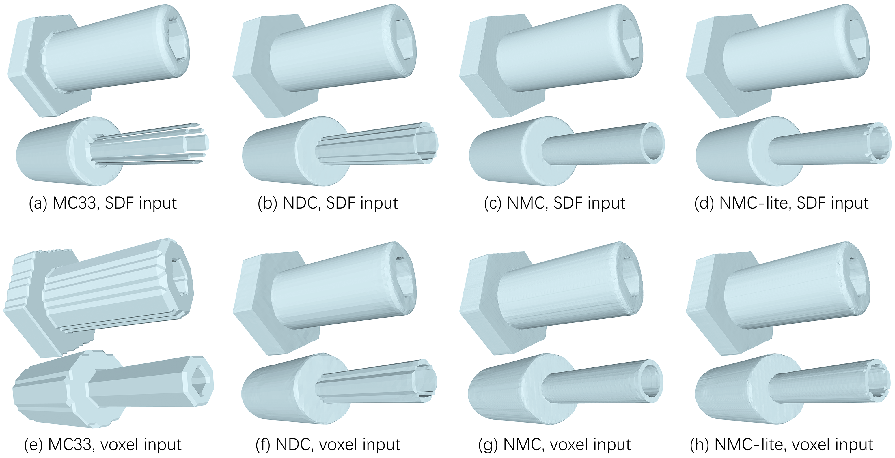

# NMC
PyTorch implementation for paper [Neural Marching Cubes](https://arxiv.org/abs/2106.11272), [Zhiqin Chen](https://czq142857.github.io/), [Hao Zhang](http://www.cs.sfu.ca/~haoz/).

### [Paper](https://arxiv.org/abs/2106.11272)  |   [Supplementary Material (to be updated)](https://arxiv.org/abs/2106.11272)



## Citation
If you find our work useful in your research, please consider citing:

	@article{chen2021nmc,
	  title={Neural Marching Cubes},
	  author={Zhiqin Chen and Hao Zhang},
	  journal={arXiv preprint arXiv:2106.11272},
	  year={2021}
	}


## Notice
We have implemented [Neural Dual Contouring (NDC)](https://github.com/czq142857/NDC).
NDC is based on Dual Contouring and thus **much** easier to implement than NMC.
It produces less triangles and vertices (1/8 of NMC, 1/4 of NMC-lite, ≈MC33), with better triangle quality.
It runs faster than NMC because it has significantly less values to predict for each cube (1 bool 3 float for NDC, v.s. 5 bool 51 float for NMC), therefore the network size could be significantly reduced.
Yet, it cannot reconstruct some cube cases, and may introduce non-manifold edges.


## Requirements
- Python 3 with numpy, h5py, scipy, sklearn and Cython
- [PyTorch 1.8](https://pytorch.org/get-started/locally/) (other versions may also work)

Build Cython module:
```
python setup.py build_ext --inplace
```


## Datasets and pre-trained weights
For data preparation, please see [data_preprocessing](https://github.com/czq142857/NMC/tree/master/data_preprocessing).

We provide the ready-to-use datasets here.

- [groundtruth.7z](https://drive.google.com/file/d/1YyYOgn8uxGH6Nz_gGk8OR7IuLKUF89Ze/view?usp=sharing)

Backup links:

- [groundtruth.7z](https://pan.baidu.com/s/13xuXBz3_OQ_Ic74xBvaXKA) (pwd: 1234)

We also provide the pre-trained network weights.

- [weights.7z](https://drive.google.com/file/d/1XqJI_FMhsV-md_dgFKKUkrPktVuTMvY_/view?usp=sharing)

Backup links:

- [weights.7z](https://pan.baidu.com/s/1NWWAkbElEUy9qHsQKviP0Q) (pwd: 1234)

Note that the weights are divided into six folders:

| Folder                       | Method   | Input |
|:---------------------------- | --------:| -----:|
| 1_NMC_sdf_unit_scale         | NMC      | SDF grid, each grid cell must have unit length |
| 2_NMC_lite_sdf_unit_scale    | NMC-lite | SDF grid, each grid cell must have unit length |
| 3_NMC_voxel                  | NMC      | Voxel grid, 1=occupied, 0=otherwise|
| 4_NMC_lite_voxel             | NMC-lite | Voxel grid, 1=occupied, 0=otherwise|
| 5_NMC_sdf_scale_0.001-2      | NMC      | SDF grid, each grid cell could have length from 0.001 to 2.0 |
| 6_NMC_lite_sdf_scale_0.001-2 | NMC-lite | SDF grid, each grid cell could have length from 0.001 to 2.0 |
| This GitHub repo             | NMC      | = 5_NMC_sdf_scale_0.001-2 |


## Training and Testing

Before training, please replace *LUT_tess.npz* (the Look-Up Table for cube tessellations) in the main directory with the corresponding version of your training target (either NMC or NMC-lite). Both versions of *LUT_tess.npz* can be found at [tessellation](https://github.com/czq142857/NMC/tree/master/tessellation).

To train/test NMC with SDF input:
```
python main.py --train_bool --epoch 400 --data_dir groundtruth/gt_NMC --input_type sdf
python main.py --train_float --epoch 400 --data_dir groundtruth/gt_NMC --input_type sdf
python main.py --test_bool_float --data_dir groundtruth/gt_NMC --input_type sdf
```

To train/test NMC-lite with SDF input:
```
python main.py --train_bool --epoch 400 --data_dir groundtruth/gt_simplified --input_type sdf
python main.py --train_float --epoch 400 --data_dir groundtruth/gt_simplified --input_type sdf
python main.py --test_bool_float --data_dir groundtruth/gt_simplified --input_type sdf
```

To train/test NMC with SDF input:
```
python main.py --train_bool --epoch 200 --data_dir groundtruth/gt_NMC --input_type voxel
python main.py --train_float --epoch 100 --data_dir groundtruth/gt_NMC --input_type voxel
python main.py --test_bool_float --data_dir groundtruth/gt_NMC --input_type voxel
```

To train/test NMC-lite with SDF input:
```
python main.py --train_bool --epoch 200 --data_dir groundtruth/gt_simplified --input_type voxel
python main.py --train_float --epoch 100 --data_dir groundtruth/gt_simplified --input_type voxel
python main.py --test_bool_float --data_dir groundtruth/gt_simplified --input_type voxel
```

To evaluate Chamfer Distance, Normal Consistency, F-score, Edge Chamfer Distance, Edge F-score, you need to have the ground truth normalized obj files ready in a folder *objs*. See [data_preprocessing](https://github.com/czq142857/NMC/tree/master/data_preprocessing) for how to prepare the obj files. Then you can run:
```
python eval_cd_nc_f1_ecd_ef1.py
```

To count the number of triangles and vertices, run:
```
python eval_v_t_count.py
```

If you want to test on your own dataset, please refer to [data_preprocessing](https://github.com/czq142857/NMC/tree/master/data_preprocessing) for how to convert obj files into SDF grids and voxel grids. If your data are not meshes (say your data are already voxel grids), you can modify the code in *utils.py* to read your own data format. Check function *read_data_input_only* in *utils.py* for an example.


